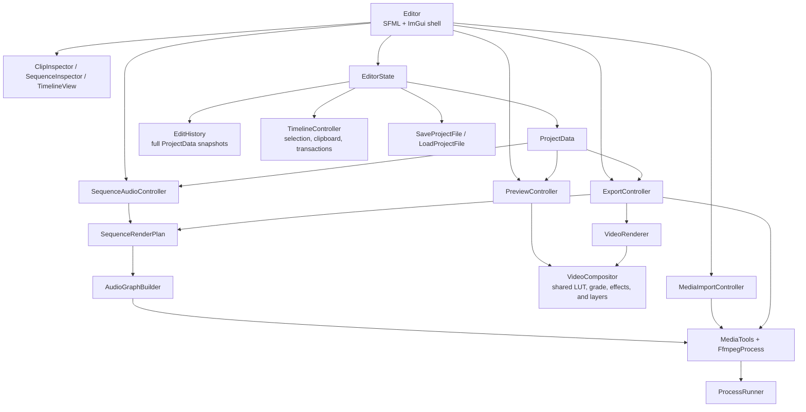

# Weasel architecture

Weasel is a small, direct desktop editor: `Editor` owns the application
UI and coordinates the project and media work.



## Ownership

- `Editor` owns the window, panels, controllers, layout, selection UI,
  and direct edit flow. Panels render against their owning editor.
- `EditorState` owns the open `ProjectData`, project directory, and derived
  `project.json`, `cache`, and `exports` paths, `TimelineController`, and
  `EditHistory`. New, open, and save live here.
- `EditHistory` is one vector of complete project-data snapshots. It has a
  current index and a saved index: undo/redo move the current index, a new
  edit drops the redo branch, and a discarded save checkpoint is `-1`.
- `ProjectData` is only saved project content: media assets, sequence,
  and export settings.
- `SaveProjectFile` and `LoadProjectFile` read and write
  `<project-directory>/project.json` through a same-folder staging file before
  atomically replacing it.
- `SequenceRenderPlan` is the shared snapshot for sequence audio and export.
  `AudioGraphBuilder`, `MediaTools`, and `FfmpegProcess` hold the shared
  FFmpeg-specific work. `ProcessRunner` is the single platform process layer
  used by FFmpeg jobs, FFprobe capture, waveform PCM streaming, and the GPU
  renderer's raw-video stream.
- `VideoCompositor` is the shared GPU visual pipeline used by interactive
  preview and GPU export. It owns LUT loading, grading, visual-effect
  passes, transforms, and layer composition; each caller retains its own
  decoding, scheduling, and output handling.

## Edit and save flow

```text
Panel interaction
  -> Editor
  -> ProjectData or TimelineController
  -> EditorState records one EditHistory snapshot
  -> Editor refreshes preview or sequence audio when needed

Save / Save As
  -> EditorState
  -> SaveProjectFile normalizes a copy and writes it atomically
  -> EditorState updates the current snapshot and marks its index saved
```
