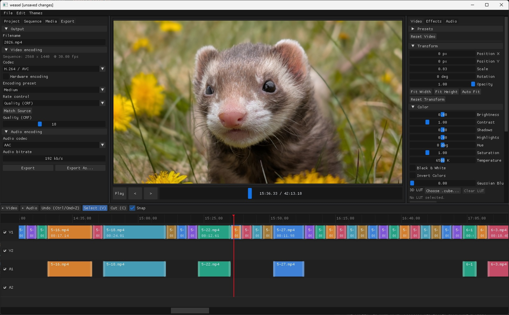

# Weasel

Weasel is a desktop video editor written in C++20 that optimizes for speed and ease of use. It provides a multitrack video and audio timeline, preview, clip effects, and export through linked FFmpeg libraries.

## Download 

- [Windows x64](https://davechurchill.ca/code/weasel/weasel-windows-x64.zip)

## Project folders

A Weasel project is stored as a folder. Saving a new project creates this basic layout:

```text
my-project/
├── project.json
├── cache/
└── exports/
```

- `project.json` stores the timeline, edit settings, export settings, and paths to imported assets.
- `cache/` contains generated waveforms and processed per-clip preview/export audio. It can be deleted while Weasel is closed and will be rebuilt as needed.
- `exports/` is the default destination for rendered videos. **Export As** can save a video somewhere else.

Imported video, audio, image, and LUT files are referenced from their existing locations; Weasel does not copy them into the project folder. Moving or renaming a referenced file after importing it can make it unavailable to the project.

## Portable application data

Weasel stores its own metadata beside the executable, rather than in the operating system's app-data directory:

```text
bin/
├── Weasel.exe
├── weasel-data/       # recent-project list and clip presets
├── projects/          # default location for new projects
└── exports/           # default location before a project is saved
```

The `bin` folder must be writable for these defaults to work.

## Building

Run the commands below from the repository root. Release builds are written to `bin/Weasel.exe` on Windows and `bin/Weasel` on Linux and macOS.

### Windows

Install Git, CMake 3.22 or newer, and Visual Studio 2022 with the **Desktop development with C++** workload, then run in PowerShell:

```powershell
.\scripts\dependencies\install-vcpkg-dependencies.bat
.\scripts\build\build_cmake.bat Release
.\bin\Weasel.exe
```

The scripts use `C:\dev\vcpkg` by default. If you keep vcpkg elsewhere, change `VCPKG_ROOT` in `install-vcpkg-dependencies.bat` and `build_cmake.bat`.

The Windows dependency profile enables the GPL x264 and x265 encoders so CPU H.264/H.265 export is always available. Redistributing a statically linked Windows binary therefore requires compliance with those codecs' GPL terms; the Weasel source remains under its repository license.

To build manually in Visual Studio after installing the dependencies, open [`visualstudio/Weasel.sln`](visualstudio/Weasel.sln) and select the `Release` and `x64` configuration. The same build can be run from the command line with:

```powershell
.\scripts\build\build_msbuild.bat Release x64
```

### Linux (Ubuntu)

The dependency installer uses APT and `sudo`, then builds the required SFML 3 and ImGui-SFML versions:

```sh
bash scripts/dependencies/install_ubuntu_dependencies.sh
sh scripts/build/build_cmake.sh Release
./bin/Weasel
```

### macOS

Install the Xcode Command Line Tools with `xcode-select --install` and install [Homebrew](https://brew.sh). Then run:

```sh
bash scripts/dependencies/install-macos-dependencies.sh
sh scripts/build/build_cmake.sh Release
./bin/Weasel
```

Linux and macOS builds use the FFmpeg libraries provided by their dependency scripts; Weasel never launches the `ffmpeg` or `ffprobe` command-line programs.
