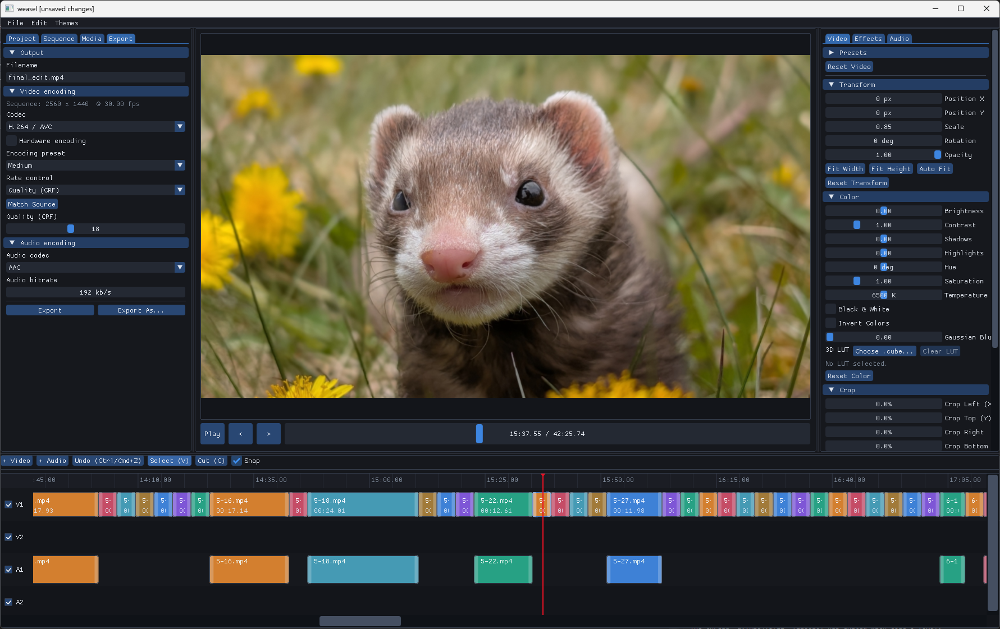

# Weasel

Weasel is a desktop video editor written in C++20 that optimizes for speed and ease of use. It provides a multitrack video and audio timeline, preview, clip effects, and FFmpeg-backed export.

## Building

Run the commands below from the repository root. Release builds are written to `bin/Weasel.exe` on Windows and `bin/Weasel` on Linux and macOS. 

### Windows

Install Git, CMake 3.22 or newer, and Visual Studio 2022 with the **Desktop development with C++** workload, then run in PowerShell:

```powershell
.\scripts\dependencies\install-vcpkg-dependencies.bat
.\scripts\build\build_cmake.bat Release
.\bin\Weasel.exe
```

The scripts use `C:\dev\vcpkg` by default. If you keep vcpkg elsewhere, change `VCPKG_ROOT` in `install-vcpkg-dependencies.bat` and `build_cmake.bat`.

To build manually in Visual Studio after installing the dependencies, open [`visualstudio/Weasel.sln`](visualstudio/Weasel.sln) and select the `Release` and `x64` configuration. The same build can be run from the command line with:

```powershell
.\scripts\build\build_msbuild.bat Release x64
```

### Linux (Ubuntu)

The dependency installer uses APT and `sudo`, then builds the required SFML 3 and ImGui-SFML versions:

```sh
bash scripts/dependencies/install_ubuntu_dependencies.sh
sh scripts/build/build_cmake.sh Release
./bin/Weasel
```

### macOS

Install the Xcode Command Line Tools with `xcode-select --install` and install [Homebrew](https://brew.sh). Then run:

```sh
bash scripts/dependencies/install-macos-dependencies.sh
sh scripts/build/build_cmake.sh Release
./bin/Weasel
```

Linux and macOS builds use the shared libraries and FFmpeg installation provided by their dependency scripts; they are development builds rather than portable application bundles.
